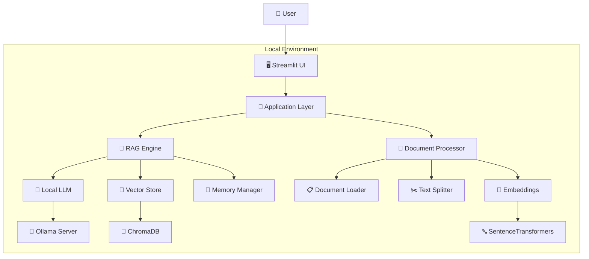
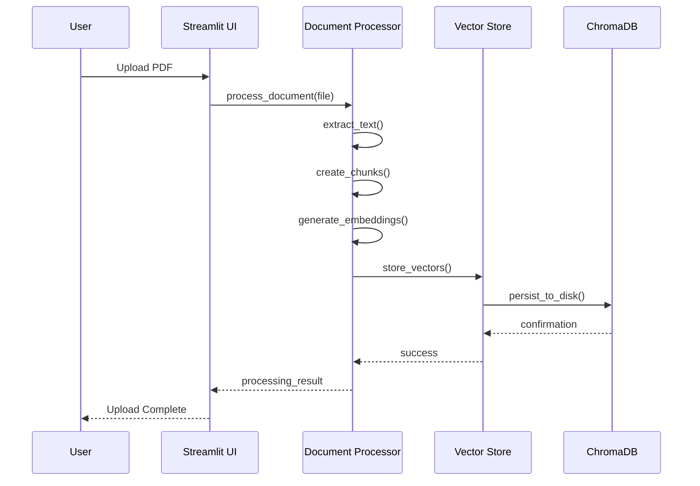
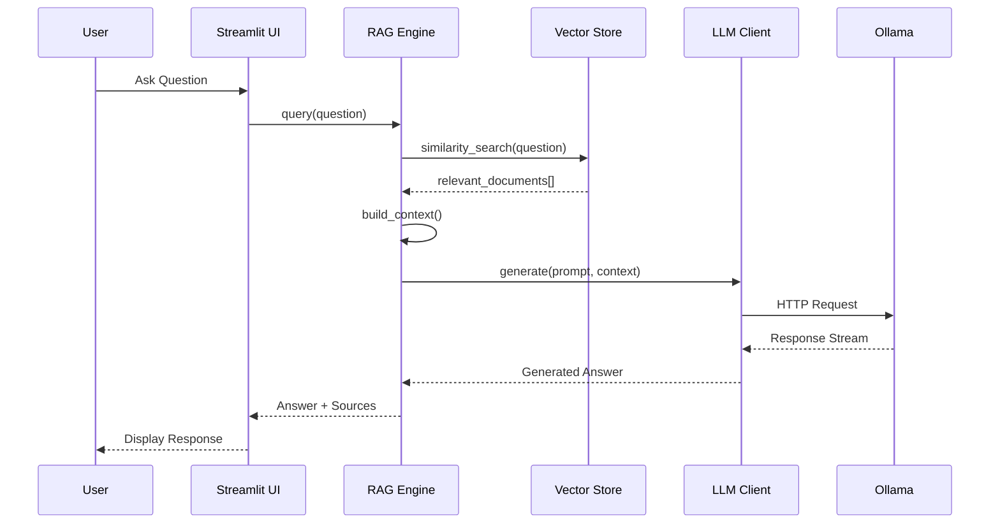

# 🏗️ System Architecture - Weekend RAG Local

## 📋 Overview

This document describes the architecture of our local RAG (Retrieval-Augmented Generation) system, designed for weekend implementation while maintaining production-quality standards.

## 🎯 Design Principles

### Core Principles
- **Local-First**: Everything runs on user's machine, no external dependencies
- **Privacy-Focused**: Documents never leave the local environment
- **Cost-Effective**: Zero ongoing operational costs after initial setup
- **Extensible**: Modular design allows easy feature additions
- **Performance-Conscious**: Optimized for consumer hardware

### Technical Principles
- **Simplicity**: Prefer simple solutions over complex ones
- **Modularity**: Clear separation of concerns
- **Testability**: Each component can be tested independently
- **Configurability**: Key parameters exposed to users
- **Observability**: Built-in logging and monitoring

---

## 🏛️ High-Level Architecture



---

## 🔧 Component Architecture

### 1. Presentation Layer

#### Streamlit UI (`main.py`)
```python
Responsibilities:
├── User Interface Rendering
├── File Upload Handling
├── Chat Interface Management
├── Configuration Controls
├── Error Display & Feedback
└── Real-time Updates

Key Features:
├── Drag-and-drop file upload
├── Real-time chat streaming
├── Source citation display
├── Performance metrics
├── Model switching interface
└── Settings configuration
```

**Technologies**: Streamlit, HTML/CSS, JavaScript (minimal)

### 2. Application Layer

#### Main Application Controller (`src/app_controller.py`)
```python
Responsibilities:
├── Request Routing
├── Session Management
├── Component Orchestration
├── Error Handling
├── Performance Monitoring
└── Configuration Management

Design Pattern: Controller/Coordinator
├── Mediates between UI and business logic
├── Manages application state
├── Handles cross-cutting concerns
└── Provides unified error handling
```

### 3. Business Logic Layer

#### RAG Engine (`src/rag_engine.py`)
```python
class RAGEngine:
    Components:
    ├── DocumentProcessor     # PDF → Chunks
    ├── VectorStore          # Semantic Search
    ├── LLMClient           # Text Generation
    ├── MemoryManager       # Conversation Context
    └── RetrievalStrategy   # Search Optimization
    
    Core Methods:
    ├── ingest_document()   # Add new documents
    ├── query()            # Answer questions
    ├── get_similar()      # Find related content
    └── clear_memory()     # Reset conversation
```

#### Document Processor (`src/document_processor.py`)
```python
class DocumentProcessor:
    Pipeline:
    ├── Document Loading     # PDF → Raw Text
    ├── Text Cleaning       # Normalize & Clean
    ├── Intelligent Chunking # Semantic Boundaries
    ├── Metadata Extraction # Source Information
    └── Embedding Generation # Text → Vectors
    
    Supported Formats:
    ├── PDF (PyPDF2/PyMuPDF)
    ├── DOCX (python-docx)
    ├── TXT (plain text)
    └── Future: HTML, MD, etc.
```

#### LLM Client (`src/llm_client.py`)
```python
class LocalLLMClient:
    Capabilities:
    ├── Model Management     # Load/Switch models
    ├── Generation          # Text completion
    ├── Streaming          # Real-time responses
    ├── Error Recovery     # Fallback strategies
    └── Performance Monitor # Token/sec tracking
    
    Supported Models:
    ├── Hermes 2.5 Mistral 7B (Primary)
    ├── Llama 3.1 8B (Alternative)
    ├── Phi-3.5 Mini (Lightweight)
    └── Code Llama 13B (Specialized)
```

### 4. Data Layer

#### Vector Store (`src/vector_store.py`)
```python
class VectorStore:
    Architecture:
    ├── ChromaDB Client     # Vector Database
    ├── Collection Manager  # Index Management
    ├── Embedding Function # Text → Vectors
    ├── Search Engine      # Similarity Search
    └── Persistence Layer  # Disk Storage
    
    Operations:
    ├── add_documents()    # Store new vectors
    ├── similarity_search() # Find similar docs
    ├── filter_search()    # Metadata filtering
    └── get_collection_stats() # Monitoring
```

#### Memory Manager (`src/memory_manager.py`)
```python
class MemoryManager:
    Types:
    ├── Conversation Memory # Chat history
    ├── Document Context   # Active documents
    ├── User Preferences   # Settings/configs
    └── Session State     # Temporary data
    
    Storage:
    ├── In-Memory (Runtime)
    ├── Local Files (Persistence)
    └── Vector Store (Semantic memory)
```

---

## 🔄 Data Flow Architecture

### Document Ingestion Flow


### Query Processing Flow


---

## 💾 Data Architecture

### File System Structure
```
data/
├── uploads/                 # Original uploaded files
│   ├── document1.pdf
│   ├── document2.pdf
│   └── ...
├── chromadb/               # Vector database storage
│   ├── chroma.sqlite3      # Metadata database
│   ├── collections/        # Vector collections
│   └── embeddings/         # Embedding cache
├── cache/                  # Application cache
│   ├── embeddings/         # Embedding cache
│   ├── models/            # Model cache
│   └── temp/              # Temporary files
└── logs/                   # Application logs
    ├── app.log
    ├── performance.log
    └── error.log
```

### Vector Database Schema
```python
# ChromaDB Collection Structure
Collection: "weekend_rag"
├── Documents: List[str]     # Chunk content
├── Embeddings: List[float]  # Vector embeddings
├── Metadata: Dict[str, Any] # Source information
│   ├── source_file: str     # Original filename
│   ├── chunk_id: str        # Unique identifier
│   ├── chunk_index: int     # Position in document
│   ├── file_hash: str       # File checksum
│   ├── timestamp: datetime  # Processing time
│   └── content_type: str    # Document type
└── IDs: List[str]          # Unique identifiers
```

### Memory Management
```python
# Session State Structure (Streamlit)
st.session_state = {
    "rag_engine": RAGEngine,           # Core engine instance
    "messages": List[Dict],            # Chat history
    "uploaded_files": List[str],       # Processed files
    "current_model": str,              # Active LLM model
    "config": Dict[str, Any],          # User settings
    "performance_metrics": Dict        # Runtime metrics
}
```

---

## ⚡ Performance Architecture

### Memory Management Strategy
```python
# Memory allocation priorities
High Priority (Always in RAM):
├── Active LLM model        # ~5-8GB
├── Embedding model         # ~500MB
├── ChromaDB client         # ~200MB
└── Current conversation    # ~10MB

Medium Priority (Cache):
├── Recent embeddings       # ~1GB
├── Frequent documents      # ~500MB
└── Model artifacts         # ~2GB

Low Priority (Disk):
├── Full document store     # Unlimited
├── Historical conversations # Unlimited
└── Performance logs        # Unlimited
```

### Caching Strategy
```python
# Multi-level caching approach
Level 1 - Memory Cache (LRU):
├── Recent embeddings       # 1000 items
├── Frequent queries        # 500 items
└── Model outputs          # 100 items

Level 2 - Disk Cache:
├── Embedding cache         # Persistent
├── Model downloads         # Persistent
└── Processed documents     # Persistent

Level 3 - Vector Database:
├── All document embeddings # Persistent
├── Metadata index         # Persistent
└── Collection statistics  # Persistent
```

### Concurrency Model
```python
# Threading strategy
Main Thread:
├── Streamlit UI rendering
├── User interaction handling
└── Session state management

Background Threads:
├── Document processing     # CPU intensive
├── Embedding generation    # GPU/CPU intensive
├── Vector storage         # I/O intensive
└── Model inference        # GPU intensive

Thread Pool Configuration:
├── Max workers: 4 (CPU cores)
├── Queue size: 10 (pending tasks)
└── Timeout: 300s (long operations)
```

---

## 🔒 Security Architecture

### Data Protection
```python
# Security principles
Local-Only Processing:
├── No external API calls
├── No data transmission
├── No cloud dependencies
└── Complete user control

Input Validation:
├── File type validation
├── File size limits
├── Content sanitization
└── Path traversal prevention

Resource Protection:
├── Memory usage limits
├── Disk space monitoring
├── CPU usage throttling
└── GPU memory management
```

### Access Control
```python
# Current implementation (single-user)
File System Access:
├── Read: data/ directory only
├── Write: data/ directory only
├── Execute: Python scripts only
└── Network: localhost only

# Future multi-user considerations
User Isolation:
├── Per-user data directories
├── Session-based access control
├── Document sharing permissions
└── API authentication
```

---

## 📊 Monitoring Architecture

### Performance Metrics
```python
# Real-time monitoring
System Metrics:
├── CPU usage percentage
├── Memory consumption (RAM/VRAM)
├── Disk I/O operations
└── Network connections

Application Metrics:
├── Response times (p50, p95, p99)
├── Query throughput (queries/minute)
├── Error rates (by component)
└── Model performance (tokens/second)

Business Metrics:
├── Documents processed
├── Questions answered
├── User satisfaction (implicit)
└── Feature usage statistics
```

### Logging Strategy
```python
# Structured logging approach
Log Levels:
├── DEBUG: Detailed debugging info
├── INFO: General application flow
├── WARNING: Potential issues
├── ERROR: Handled exceptions
└── CRITICAL: System failures

Log Destinations:
├── Console: Development
├── Files: Production
├── Structured: JSON format
└── Rotation: Size/time based

Key Log Events:
├── Document processing
├── Query execution
├── Model loading/switching
├── Error conditions
└── Performance metrics
```

---

## 🚀 Deployment Architecture

### Local Development
```bash
# Development stack
Application Server:
├── Streamlit dev server    # Port 8501
├── Hot reload enabled      # Code changes
├── Debug mode active       # Detailed logs
└── Local file watching     # Auto-restart

Dependencies:
├── Ollama server          # Port 11434
├── Python virtual env     # Isolated packages
├── Local ChromaDB         # File-based storage
└── Development tools      # Testing, linting
```

### Production Deployment
```yaml
# Docker composition
services:
  app:
    build: .
    ports: ["8501:8501"]
    volumes: ["./data:/app/data"]
    environment:
      - OLLAMA_URL=http://ollama:11434
    depends_on: [ollama]
  
  ollama:
    image: ollama/ollama:latest
    ports: ["11434:11434"]
    volumes: ["ollama_data:/root/.ollama"]
    deploy:
      resources:
        reservations:
          devices:
            - driver: nvidia
              count: 1
              capabilities: [gpu]
```

### Cloud Deployment Options
```python
# Platform considerations
AWS EC2:
├── GPU instances (g4dn.xlarge)
├── EBS storage for data
├── Security groups for access
└── Auto-scaling (future)

Google Cloud:
├── Compute Engine with GPUs
├── Persistent disks
├── VPC networking
└── Cloud Run (containerized)

Self-Hosted:
├── Docker Compose setup
├── Reverse proxy (nginx)
├── SSL termination
└── Backup strategies
```

---

## 🔄 Extension Points

### Plugin Architecture (Future)
```python
# Extensibility design
Document Loaders:
├── Base: DocumentLoader
├── PDF: PyPDFLoader
├── DOCX: DocxLoader
├── Custom: UserDefinedLoader
└── Future: WebLoader, APILoader

LLM Providers:
├── Base: BaseLLMClient
├── Ollama: OllamaClient
├── Local: TransformersClient
├── Custom: CustomLLMClient
└── Future: CloudLLMClient

Vector Stores:
├── Base: BaseVectorStore
├── ChromaDB: ChromaVectorStore
├── FAISS: FAISSVectorStore
├── Custom: CustomVectorStore
└── Future: PineconeVectorStore
```

### API Extension Points
```python
# Future API endpoints
REST API Routes:
├── POST /documents        # Upload documents
├── GET /documents         # List documents
├── DELETE /documents/{id} # Remove document
├── POST /query           # Ask questions
├── GET /health           # System status
└── WebSocket /chat       # Real-time chat

Integration Hooks:
├── Pre-processing hooks   # Document modification
├── Post-processing hooks  # Response enhancement
├── Authentication hooks   # User validation
└── Monitoring hooks      # Custom metrics
```

---

## 📈 Scaling Considerations

### Horizontal Scaling (Future)
```python
# Multi-instance architecture
Load Balancer:
├── Request distribution
├── Health checking
├── Session affinity
└── SSL termination

Application Instances:
├── Stateless design
├── Shared data layer
├── Distributed caching
└── Async processing

Data Layer:
├── Distributed vector DB
├── Shared file storage
├── Centralized logging
└── Metrics aggregation
```

### Performance Optimization
```python
# Optimization strategies
Model Optimization:
├── Quantization (4-bit, 8-bit)
├── Model pruning
├── Knowledge distillation
└── Hardware-specific optimization

Inference Optimization:
├── Batch processing
├── Caching strategies
├── Parallel processing
└── GPU memory optimization

Data Optimization:
├── Embedding compression
├── Index optimization
├── Query caching
└── Prefetching strategies
```

---

## 🎯 Design Decisions & Trade-offs

### Key Decisions

| Decision | Rationale | Trade-offs |
|----------|-----------|------------|
| **Ollama over vLLM** | Easier setup, better UX | Lower peak performance |
| **ChromaDB over FAISS** | Built-in persistence, easier API | Higher memory usage |
| **Streamlit over FastAPI+React** | Faster development, integrated | Less customization |
| **Local-only architecture** | Privacy, cost, simplicity | Scalability limitations |
| **Python over Rust/Go** | ML ecosystem, rapid development | Runtime performance |

### Performance Trade-offs

| Aspect | Choice | Pro | Con |
|--------|-------|-----|-----|
| **Model Size** | 7B parameters | Good quality, reasonable speed | High memory usage |
| **Chunk Size** | 800 tokens | Good context, fast search | May split concepts |
| **Vector Dimensions** | 384 (MiniLM) | Fast search, low memory | Reduced semantic resolution |
| **Context Window** | 4K tokens | Good context retention | Higher inference cost |

### Future Considerations

```python
# Architectural evolution path
Phase 1 (Current):
├── Single-user, local-only
├── Basic RAG pipeline
├── Simple UI
└── Core functionality

Phase 2 (Next weekend):
├── Multi-format support
├── Advanced retrieval
├── Conversation memory
└── Performance optimization

Phase 3 (Future):
├── Multi-user support
├── Cloud deployment
├── API development
└── Plugin architecture

Phase 4 (Advanced):
├── Multi-modal capabilities
├── Agent functionality
├── Enterprise features
└── AI model fine-tuning
```

---

## 📚 References & Further Reading

### Technical Documentation
- [LangChain Documentation](https://python.langchain.com/)
- [ChromaDB Documentation](https://docs.trychroma.com/)
- [Ollama Documentation](https://ollama.ai/docs)
- [Streamlit Documentation](https://docs.streamlit.io/)

### Research Papers
- [Retrieval-Augmented Generation for Knowledge-Intensive NLP Tasks](https://arxiv.org/abs/2005.11401)
- [Dense Passage Retrieval for Open-Domain Question Answering](https://arxiv.org/abs/2004.04906)
- [Sentence-BERT: Sentence Embeddings using Siamese BERT-Networks](https://arxiv.org/abs/1908.10084)

### Model Documentation
- [Hermes 2.5 Model Card](https://huggingface.co/NousResearch/Hermes-2.5-Mistral-7B)
- [Llama 3.1 Model Card](https://github.com/facebookresearch/llama)
- [Phi-3.5 Technical Report](https://arxiv.org/abs/2404.14219)

---

**Document Version**: 1.0  
**Last Updated**: Project Start Date  
**Maintainer**: Your Name  
**Review Cycle**: After each development phase